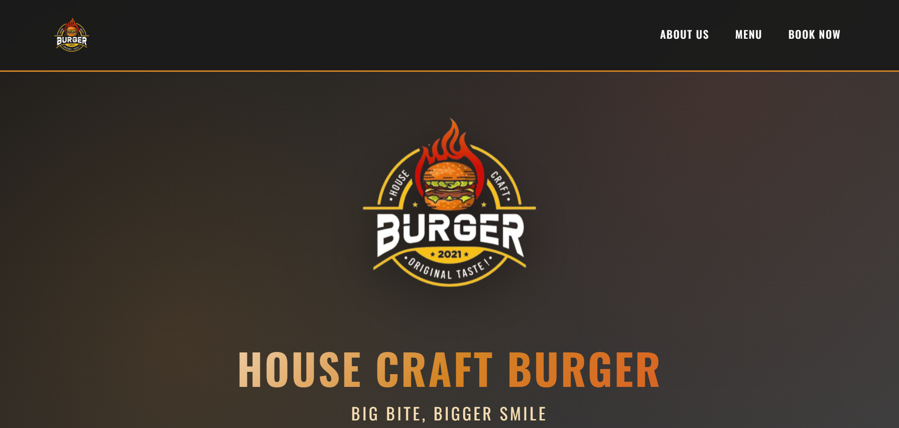
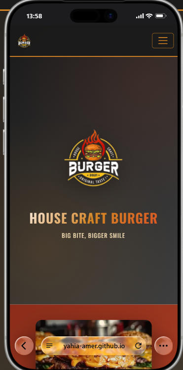

# House Craft Burger

A responsive burger restaurant landing page built with HTML, CSS, and Bootstrap.

The project was built as a front-end practice project with a focus on layout, responsive design, and presenting a restaurant menu in a clean and simple way.

## Features

- Responsive layout for desktop, tablet, and mobile screens
- Responsive navigation menu
- Hero section
- About Us section
- Burger menu cards
- Booking form interface
- Custom CSS styling
- Bootstrap 5 grid and components

## Technologies

- HTML5
- CSS3
- Bootstrap 5.3.2
- Google Fonts

## Preview

### Desktop



### Mobile



## Live Demo

https://yahia-amer.github.io/House-Craft-Burger/

## Project Structure

```text
House-Craft-Burger/
│
├── index.html
├── README.md
│
├── Burger.css/
│   ├── burger.css
│   └── responsive.css
│
└── photos/
    ├── logo.png
    ├── Burger.png
    ├── burger1.jpg
    ├── burger2.jpg
    ├── burger3.jpg
    ├── burger4.jpg
    ├── burger5.jpg
    └── burger6.jpg
```

## Responsive Design

The layout adapts to different screen sizes using Bootstrap's responsive grid together with custom CSS media queries.

The navigation, menu cards, images, text, and booking section are adjusted for smaller screens.

## Notes

The booking form is currently a front-end interface and does not process real reservations.

## Author

Yahia Amer

Front-End Developer
